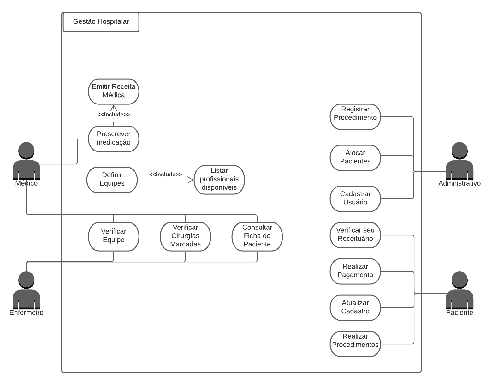

# gHosp

## 1. Objetivos
Um software em aplicação web para operar como um sistema de gestão hospitalar.

## 2. Análise
## 2.1 Requisitos do Sistema
### 2.1.1 Requisitos Funcionais
  * [RF01] – O médico e o enfermeiro podem consultar a ficha do paciente.
  * [RF02] – O médico e o enfermeiro podem verificar as cirurgias marcadas.
  * [RF03] – O médico e o enfermeiro podem consultar suas equipes.
  * [RF04] – O médico pode prescrever a medicação para um paciente.
  * [RF05] – O enfermeiro pode verificar os pacientes internados e que precisam de cuidados.
  * [RF06] – O paciente pode verificar o seu receituário.
  * [RF07] – O paciente pode realizar o pagamento das suas despesas.
  * [RF08] – O paciente pode submeter-se aos procedimentos hospitalares.
  * [RF09] – A administração define as equipes de médicos e enfermeiros.
  * [RF10] – A administração aloca as equipes para as salas de operações hospitalares.
  * [RF11] – A administração pode alocar os pacientes para as salas de cirurgias, de recuperação etc.
### 2.1.2 Requisitos Não Funcionais
  * [RNF01] – O sistema deve ser uma aplicação web responsiva e desenvolvida para rodar em qualquer aparelho com um navegador de internet.
  * [RNF02] – O sistema deverá ser desenvolvido em PHP, JavaScript e VueJS.
  * [RNF03] – Os procedimentos hospitalares disponíveis no sistema são: consultas, exames, cirurgias, internações ou outro procedimento de hospital.
  * [RNF04] – O paciente deve entrar no sistema com o número de CPF e uma senha definida no início do cadastro do mesmo no hospital.
  * [RNF05] – Os receituários deverão ficar no ar para os pacientes no período referente ao tratamento dos mesmos. 
  * [RNF06] – O paciente poderá realizar o pagamento pelo sistema com as principais formas de pagamento ou por meio de convênio.
  * [RNF07] – O limite de integrantes das equipes varia de acordo com a gravidade dos procedimentos hospitalares.
  * [RNF08] – O sistema não permitirá a alocação de médico/enfermeiro que estão com a carga horária cheia.

## 2.2 Casos de Uso
### 2.2.1 Diagrama de Casos de Uso

Format: 
### 2.2.2 Descrição dos Casos de Uso
* ##### Definir equipe
    * **Descrição:** O usuário Admnistrativo deverá fazer a definição de equipe de funcionários.
    * **Ator:** Admnistração.
    * **Pré-condições:**
	    * Haver um paciente que irá realizar um procedimento que necessitará de uma equipe.
	    * Haver funcionários disponiveis para formação de equipe.
    * **Fluxo principal:**
        1. O usuário da Admnistração irá entrar no sistema e em seguida na tela de cadastro de equipes.
        2. O usuário da Admnistração formará a equipe de acordo com os requisitos do procedimento que esta irá realizar.
    * **Fluxo alternativo:** 
        1. Caso o procedimento seja cancelado, aquela equipe será desfeita, caso nao haja outro procedimento equivalente à ser realizade.* 
    * **Pós-condição:** 
        * Deverá ser registrado no sistema a equipe formada.
* ##### Alocar pacientes
    * **Descrição:** O usuário Admnistrativo deverá alocar o paciente na região do hospital especializada para a realização dos seus procedimentos necessários.
    * **Ator:** Admnistração.
    * **Pré-Condições:** 
        * O paciente deverá ser cadastrado no sistema.
        * Haver vagas para novos pacientes.
    * **Fluxo principal:**
        1. Identificar os procedimentos necessários do Paciente.
        2. Alocar o Paciente de acordo com seus procedimentos.
    * **Fluxo alternativo:**
        1. Falta de suporte ao procedimento: Caso não haja suporte para o procedimento do Paciente ele não será alocado.
    * **Pós-Condição:**
        * Deverá ser registrado no sistema os dados de alocamento do paciente.
        * O usuário da Admnistração será redirecionado para a sua tela principal.
* ##### Realizar procedimentos
    * **Descrição:** O paciente irá requerir a realização de procedimentos.
    * **Ator:** Paciente.
    * **Pré-Condição:**
        * O ator deverá estar cadastrado no sistema.
        * O ator não deve apresentar pendências em pagamentos de procedimentos anteriores.
        * O Hospital terá que conter suporte para a realização do procedimento.
    * **Fluxo principal:**
        1. O ator entrará em sua conta.
        2. O ator escolherá um dos procedimentos disponíveis para requerir a realização.
            * Marcar consulta.
            * Marcar realização de exames.
    * **Fluxo alternativo:**
        * Caso não haja disponibilidade imediata para a realização do procedimento o Paciente deverá ser avisado e intrucionado a requerir seu procedimento para outra ocasião. 
    * **Pós-Condição:**
        * Deverá ser registrado no sistema os procedimentos requeridos.
        * O Paciente será redirecionado para sua página principal.
* ##### Verificar cirurgias
    * **Descrição:** Irá disponibilizar os procedimentos a serem realizados pelo Médico ou Enfermeiro.
    * **Atores:** Médico e Enfermeiro.
    * **Pré-Condição:**
        * O ator deve estar cadastrado no sistema.
        * O ator deve estar em uma equipe.
    * **Fluxo principal:**
        1. O ator irá abrir painel principal.
        2. Através de um botão neste painel o ator irá requerir suas cirurgias agendadas.
    * **Pós-Condição:**
        * O sistema deverá exibir uma página contendo os dados das cirurgias agendadas.
* ##### Prescrever medicação
    * **Descrição:** O Médico irá receitar medicações.
    * **Ator:** Médico.
    * **Pré-Condição:**
        * Médico deverá estar na equipe destinada ao atendimento do procedimento do Paciente que estará a receber a prescição médica.   
        * Dados do paciente estarem preenchidos com possíveis alergias à medicações.
    * **Fluxo principal:**
        1. O ator acessará sua lista de pacientes em seu painel principal.
        2. O sistema deverá mostrar os dados do Paciente escolhido, incluindo as alergias.
        3. O ator prescreverá através de uma receita digital/física a medicação.
        4. O sistema confirmará se nenhuma medicação passada está conflitando com as alergias.
    * **Pós-Condição:**
        * O sistema deverá disponibilizar para o Paciente, em sua tela principal, sua receita.
